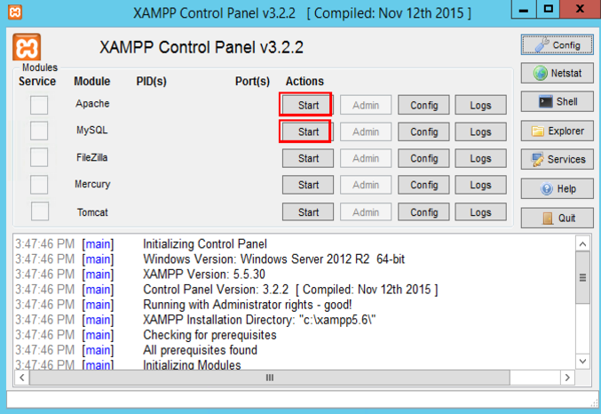
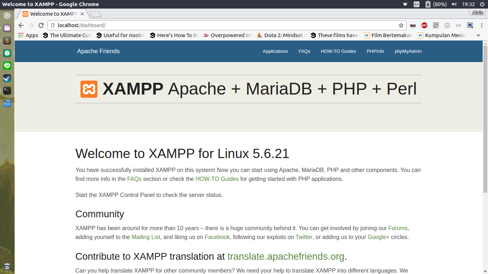
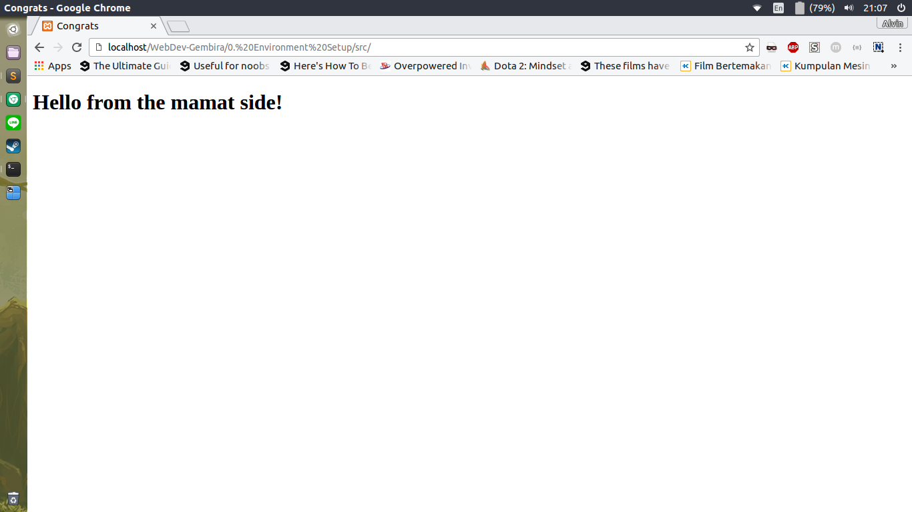

# Setting Up The Environment

## The Setup

### Choose your text editor

Karena kita akan memulai koding, maka text editor merupakan langkah pertama kita untuk memulainya. Sebenarnya tidak ada text editor khusus dalam web development, akan tetapi akan lebih baik jika memilih text editor yang mengenali snippet html, php, dan sql dan juga yang memiliki built in directory list.

Beberapa text editor yang direkomendasikan :
* [Sublime Text](https://www.sublimetext.com/3) (any version)
* [Atom](https://atom.io/)

### Setup your local server

Web development membutuhkan server, baik untuk testing maupun untuk depoloyment. Untuk testing kita bisa menggunakan server lokal yang disediakan oleh beberapa aplikasi yang berada di internet. Dianjurkan untuk memilih aplikasi server lokal yang sudah mencakup database dan panel database juga.

Aplikasi server lokal yang direkomendasikan :
* [XAMPP](https://www.apachefriends.org/download.html) (pilih versi php 5.5.* atau 5.6.*)

## Test Your Local Environment

1. Jalankan XAMPP dari komputer anda
2. Jalankan Server dan database dari panel XAMPP dengan menekan tombol start di bagian Apache dan MySQL

3. Buka [localhost](http://localhost), jika berhasil membuka dashboard xampp berarti instalasi sukses

4. Buka folder htdocs di tempat instalasi XAMPP anda ( contoh C:\XAMPP\htdocs ) kemudian buat folder "introduction"
5. Download file index.html dari folder src repository ini kemudian simpan di folder "introduction"
6. Buka [introduction](http://localhost/introduction), jika browser membuka gambar di bawah ini berarti setup environment telah sukses, congrats! ^_^
